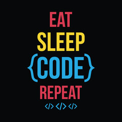

<h1 align="center">
  
  Hi! 
  
</h1>

  
  

---

I am curious about machine learning and deep learning as well as data analysis 

As a young analyst, I seek to learn new things and improve myself continuously!

I like to share my experiences here and use the experiences of others to improve my abilities.

---

### :fire: My Stats :

---

Wanna find me? just click the links below:

  
  

